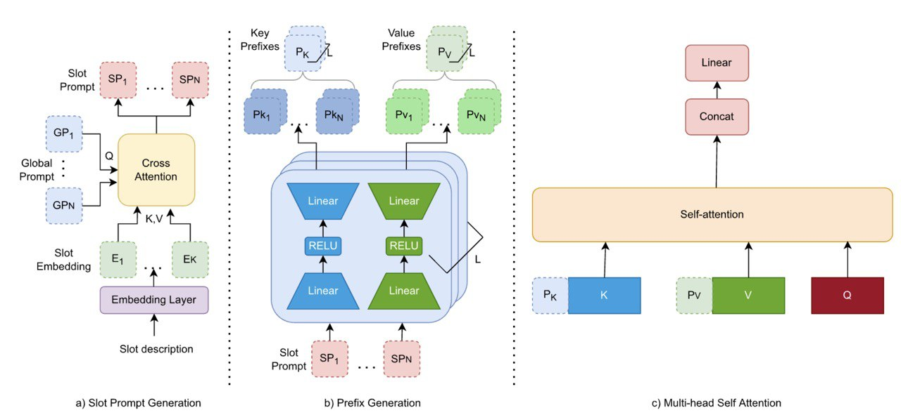

# Prompter: Zero-shot Adaptive Prefixes for Dialogue State Tracking Domain Adaptation
[]()

## Abstract:
A  challenge in the Dialogue State Tracking (DST) field is adapting models to new domains without using any supervised data — zero-shot domain adaptation. Parameter-Efficient Transfer Learning (PETL) has the potential to address this problem due to its robustness. However, it has yet to be applied to the zero-shot scenarios, as it is not clear how to apply it unsupervisedly. 

Our method, Prompter, uses /home/users/astar/i2r/stuait/scratch/Projects/Prompter/srcdescriptions of target domain slots to generate dynamic prefixes that are concatenated to the key and values at each layer's self-attention mechanism. This allows for the use of prefix-tuning in zero-shot. Prompter outperforms previous methods on both the MultiWOZ and SGD benchmarks. In generating prefixes, our analyses find that Prompter not only utilizes the semantics of slot descriptions but also how often the slots appear together in conversation. Moreover, Prompter's gains are due to its improved ability to distinguish none-valued dialogue slots, compared against baselines.
## Method:
<p align="center">

</p>
 (a) Slot Prompt Generation where the information from the description is fused with some global prompt to generate slot-specific prompts, (b) Prefix Generation which feeds slot prompts across two linear layers and an activation function to generate per-layer key and value prefixes, (c) Finally these prefixes are concatenated to keys and values at every layer of the T5 encoder.


## Setting up the environment
Create a new environment with python>=3.8.12
```console
conda create -n prompter python==3.8.12
```

Change directory to the main folder and install the packages
```console
cd Prompter
pip install -r requirements.txt
pip install -e .
```
## Experiments

**Dataset Generation**

*MultiWOZ*
```console
python create_mwoz.py
```
use create_mwoz_2_1.py if want to run with multiwoz2.1

*SGD*
```console
./download_sgd.sh
```

**Zero-shot cross-domain Experiments**

*MultiWOZ* 
```console
./run_mwoz.sh "domain"
```
* domain: the left out domain, choose one from [hotel, train, attraction, restaurant, taxi]

Note: For MultiWOZ, 5 separate runs needed to replicate experiments in the paper where each time an individual domain is left out.

*SGD* 
```console
./run_sgd.sh
```
**Evaluation**

The training script automatically evaluates the results and puts the relative files under the results folder of the run (src/save/path_to_the_run/results/...)

For SGD dataset you can also use the provided official scripts. Set the PRED variable inside `sgd_eval.sh` to the run directory under 'src/save/...' :
```console
cd scripts
./sgd_eval.sh
```
This will generate a new file `result.json` in the run directory.

**Generating Heatmaps for models trained on MultiWOZ**
```console
cd scripts
./generate_heat_map.sh "domain" "ckpt_file"
```
- domain: The leftout domain

- ckpt_file: Path to the .ckpt file in the model directory

