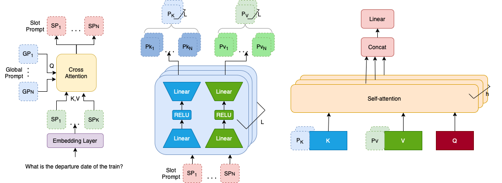

# Prompter: Zero-shot Adaptive Prefixes for Dialogue State Tracking Domain Adaptation
[]()

## Abstract:
A  challenge in the Dialogue State Tracking (DST) field is adapting models to new domains without using any supervised data zero-shot domain adaptation. Parameter-Efficient Transfer Learning (PETL) has the potential to address this problem due to its robustness. However, it has yet to be applied to the zero-shot scenarios, as it is not clear how to apply it unsupervisedly. 

Our method, Prompter, uses descriptions of target domain slots to generate dynamic prefixes that are concatenated to the key and values at each layer's self-attention mechanism. This allows for the use of prefix-tuning in zero-shot. Prompter outperforms previous methods on both the MultiWOZ and SGD benchmarks. In generating prefixes, our analyses find that Prompter not only utilizes the semantics of slot descriptions but also how often the slots appear together in conversation. Moreover, Prompter's gains are due to its improved ability to distinguish none-valued dialogue slots, compared against baselines.
## Method:
<p align="center">

</p>
 (a) Slot Prompt Generation where the information from the description is fused with some global prompt to generate slot-specific prompts, (b) Prefix Generation which feeds slot prompts across two linear layers and an activation function to generate per-layer key and value prefixes, (c) Finally these prefixes are concatenated to keys and values at every layer of the T5 encoder.


## Dependency
Check the packages needed or simply run the command
```console
❱❱❱ pip install -r requirements.txt
```

## Experiments

**Dataset Generation**

*MultiWOZ*
```console
❱❱❱ cd scripts
❱❱❱ python create_mwoz.py
```
use create_mwoz_2_1.py if want to run with multiwoz2.1

*SGD*
```console
❱❱❱ cd scripts
❱❱❱ ./download_sgd.sh
```

**Zero-shot cross-domain Experiments**

*MultiWOZ* 
```console
❱❱❱ run_mwoz.sh "domain"
```
* domain: held out domain, choose one from [hotel, train, attraction, restaurant, taxi]
Note: For MultiWOZ, 5 separate runs needed to replicate experiments in the paper where each time an individual domain is left out.

*SGD* 
```console
❱❱❱ run_sgd.sh
```

**Generating Heatmaps**
```console
❱❱❱ cd scripts
❱❱❱ generate_heat_map.sh "DOMAIN" "CKPT_FILE"
```
"DOMAIN" - The leftout domain

"CKPT_FILE" - Path to the .ckpt file in the model directory

